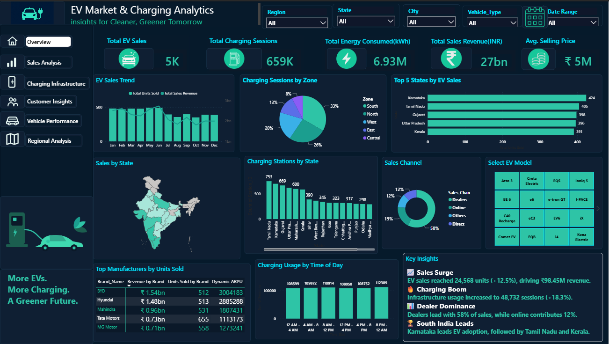
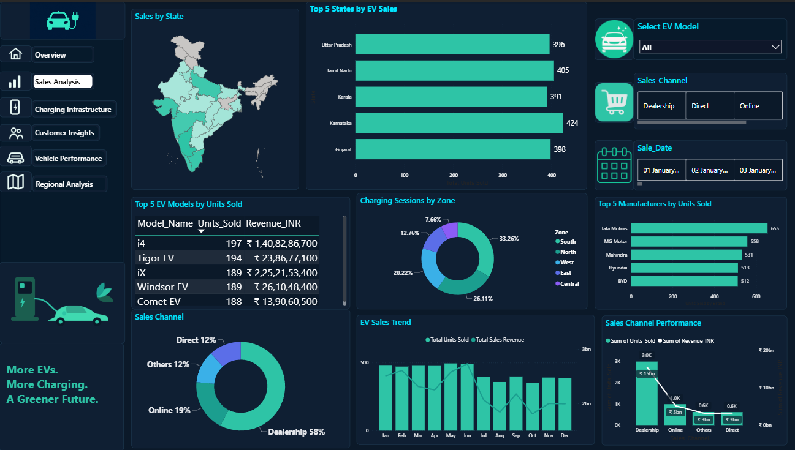
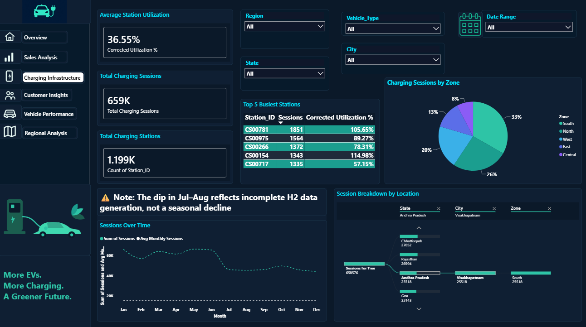
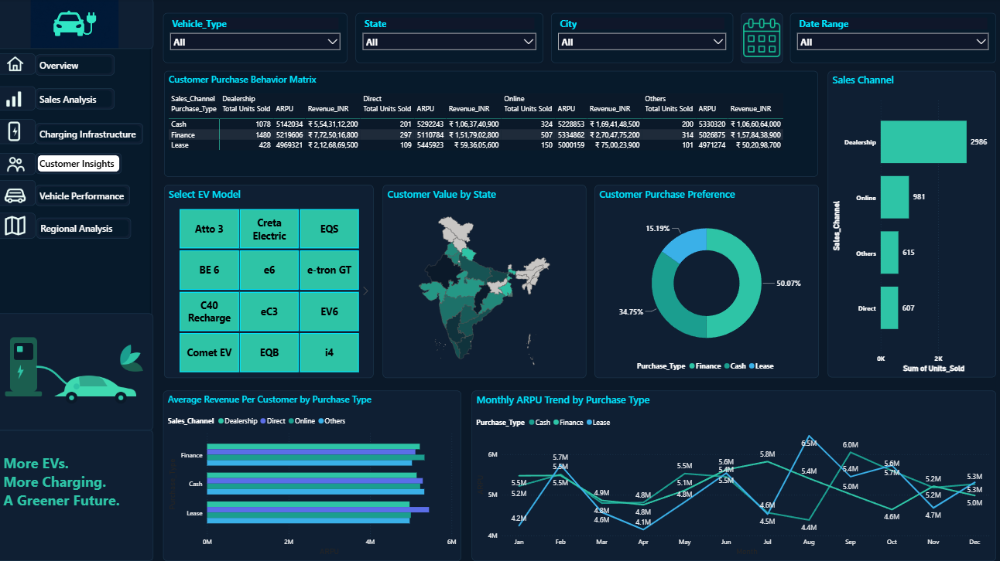
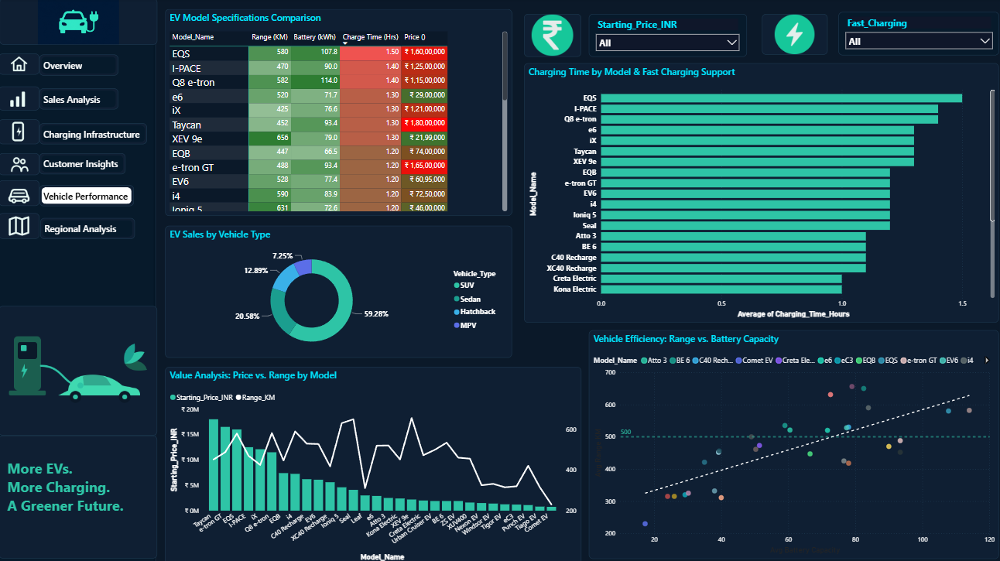
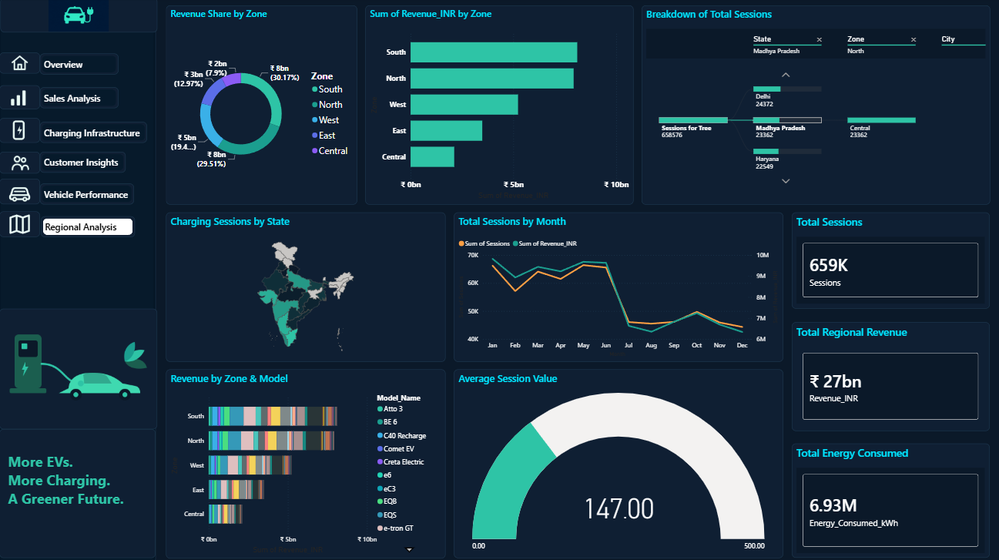

# EV Market & Charging Analytics — Power BI Dashboard

An interactive **Power BI dashboard project** analyzing Electric Vehicle (EV) sales, charging infrastructure, customer insights, and vehicle performance.

##  Project Overview

This project provides a comprehensive view of the Indian EV market through **6 interactive Power BI dashboard pages**. It transforms raw sales and charging data into actionable business intelligence, helping stakeholders understand adoption trends, infrastructure utilization, and model-specific performance.

The dashboard helps analyze:
-   **Sales Performance:** Revenue, units sold, and channel distribution.
-   **Charging Infrastructure:** Station density, utilization rates, and fast-charging support.
-   **Customer Behavior:** Purchase preferences (Finance vs. Cash) and regional demand.
-   **Vehicle Efficiency:** Price-to-range ratios and battery capacity analysis.

## 🛠️ Tools & Technologies

-   **Power BI Desktop** (Data Visualization & Modeling)
-   **DAX** (Advanced Calculations & Measures)
-   **Power Query** (ETL & Data Transformation)
-   **Excel** (Source Data Management)

##  Dashboard Pages

### 1. Overview
High-level KPIs including Total Revenue, Units Sold, and Average Selling Price. Features a summary of sales by vehicle type and region.

### 2. Sales Analysis
Deep dive into sales performance by State, City, and Sales Channel. Includes trend analysis and customer purchase behavior matrices.

### 3. Charging Infrastructure
Analysis of charging station distribution and utilization. Features corrected utilization metrics and fast-charging adoption gauges.

### 4. Customer Insights
Customer segmentation and purchase preference analysis. Visualizes ARPU (Average Revenue Per User) trends and state-wise customer value maps.

### 5. Vehicle Performance
Model-specific analysis comparing Price vs. Range and Battery Capacity. Includes charging time comparisons and efficiency scatter plots.

### 6. Regional Analysis
Geospatial and zone-wise performance breakdown. Highlights top-performing regions and infrastructure gaps.

## 📈 Key Analysis & Improvements

The dashboard focuses on critical business questions:
-   **Fast Charging Adoption:** What percentage of models support fast charging? (Fixed Gauge Logic)
-   **Station Utilization:** Which stations are over-utilized (>100%) or under-performing?
-   **Price vs. Range:** Identifying the "sweet spot" models for consumers.
-   **Sales Channels:** Dealership vs. Online performance trends.

**Recent Visual Enhancements:**
-   Converted dense stacked charts to clean **Horizontal Bar Charts** for better readability.
-   Fixed **Gauge Axis ranges** to accurately reflect percentage values (0-100%).
-   Optimized **Dark Theme contrast** for accessibility and professional presentation.

## 🎯 Project Objective

The objective of this project is to transform complex EV market and charging data into an intuitive, interactive dashboard that supports **data-driven decision-making** for manufacturers, policymakers, and investors.

## 📁 Project Files

-   `EV_Market_Charging_Analytics_Dataset.xlsx` — Source dataset
-   `EV Market and Charging Dashboard.pbix` — Power BI dashboard file
-   `01-Overview.png` to `06-Regional-Analysis.png` — Page screenshots

## 👩‍ Created By

**Sakunthala S**
*Aspiring Data Analyst | Power BI Developer*

**Skills:** Power BI | SQL | Excel | Tableau | Python | Data Visualization | DAX
